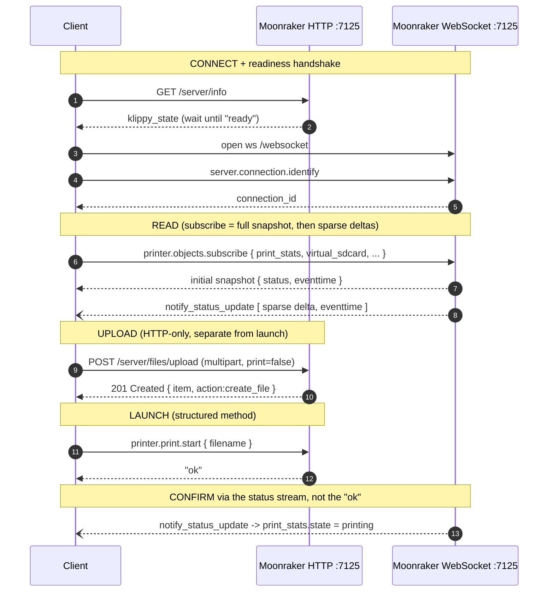
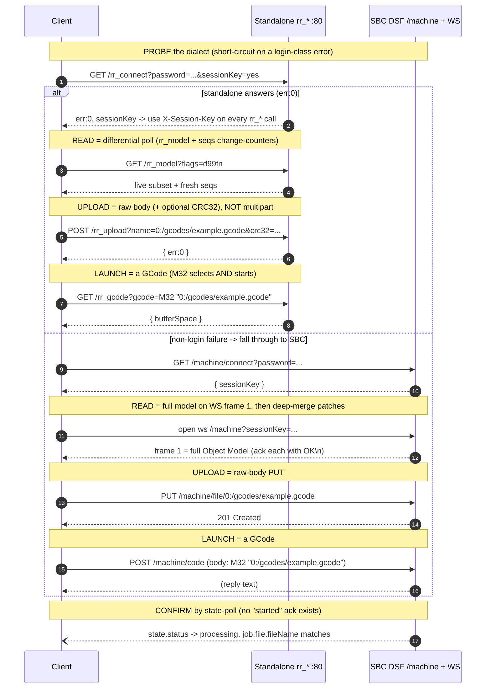

# Connection & Launch Flows

> **What this page is:** the tricky **connect → read → upload → LAUNCH → confirm** sequences for each documented
> family, drawn as Mermaid sequence diagrams. It is a cross-family companion to the per-protocol papers — each diagram
> distills that paper's *At a glance* + *write-path* sections; follow the links for field-level detail.

**The one thing to internalize: `upload != launch`.** On **every** family the file transfer and the print-start are
**separate operations, often on separate channels/ports**, and the handshake order is load-bearing. Getting the order
wrong is the single most common integration failure: you upload a file and nothing prints, or you send a start command
before the file has settled and the firmware faults (or, on SDCP, crashes). The second recurring theme: **almost no
family gives you a synchronous "print started" ack** — you confirm the launch by watching the *status stream* transition
into a printing state, not by trusting the command's response.

**Confidence** (see [`../CONFIDENCE.md`](../CONFIDENCE.md)): Anycubic + Bambu flows are 🟢 hardware-validated; every
other family here is 🟡 source-read. All IPs are placeholders (`192.0.2.x`, RFC 5737 TEST-NET-1); every credential is a
**mechanism**, never a value. Ports and channels are grouped in the [At-a-glance matrix](#at-a-glance-launch-matrix) at
the bottom.

---

## Moonraker / Klipper 🟡

HTTP + WebSocket JSON-RPC on **`:7125`**. File ops are **HTTP-only**; status subscriptions are **WebSocket-only** — so a
full client holds *both* an HTTP client and a WS connection. Upload and start are separate calls; confirm by watching a
`notify_status_update` delta flip `print_stats.state` to `printing`. Full detail:
[`../protocols/klipper-moonraker.md`](../protocols/klipper-moonraker.md).



- **Two channels, one flow.** `printer.objects.subscribe` lives on the WebSocket and its *response is the full initial
  snapshot* — seed local state from it, then deep-merge each sparse `notify_status_update` delta by `eventtime`. Upload
  and download are HTTP-only.
- **Upload ≠ launch, but they *can* be coupled** — `POST …/upload?print=true` starts the print atomically. Prefer the
  **decoupled** form shown (`print=false` then `printer.print.start`) so you own conflict policy and the started-vs-queued
  decision Moonraker otherwise hides.
- **Confirm on the delta, not the `ok`.** `printer.print.start` returns a bare `"ok"`; the real signal is
  `print_stats.state` transitioning to `printing`. Re-subscribe on every reconnect — subscriptions are **not** restored.
- **Gotcha:** `virtual_sdcard.progress` is **file-byte position, not time** — do not derive an ETA from it.

---

## Bambu Lab 🟢

**Two LAN transports at once:** MQTT over TLS **`:8883`** for state and control, implicit-TLS FTPS **`:990`** for the
file — both unlocked by turning on **LAN mode with the printer's own access code** (this is the standard LAN access mode,
nothing exotic). There is **no command ack**; you confirm by watching `push_status`. Full detail:
[`../protocols/bambu.md`](../protocols/bambu.md).

```mermaid
sequenceDiagram
    autonumber
    participant C as Client
    participant M as Printer MQTT/TLS :8883
    participant F as Printer FTPS :990

    Note over C,M: CONNECT (user bblp, password = access code)
    C->>M: MQTT CONNECT (TLS, fresh client_id)
    C->>M: subscribe device/<serial>/report
    M-->>C: (connected)

    Note over C,M: READ (pushall snapshot, then live deltas)
    C->>M: publish device/<serial>/request { pushing: pushall }
    M--)C: report snapshot (gcode_state, temps, ams, ...)
    M--)C: report deltas (deep-merge partials)

    Note over C,F: UPLOAD the .3mf (separate transport)
    C->>F: implicit TLS connect; TYPE I / PBSZ 0 / PROT P
    C->>F: STOR example.gcode.3mf (delayed data-channel TLS)
    F-->>C: 226 (read with the TRANSFER timeout) + SIZE-verify

    Note over C,M: LAUNCH references the uploaded file
    C->>M: publish device/<serial>/request { print: project_file, url ftp://..., param plate_N }
    M-->>C: (no ack)

    Note over C,M: CONFIRM by watching push_status
    M--)C: gcode_state -> PREPARE / RUNNING, subtask_id echo
```

- **LAN mode = the ordinary access mode.** The access code is a per-device secret the owner reads off the printer
  screen; on the local path commands are plain (no signed envelope, no vendor key material). Document the mechanism,
  never a value.
- **No ack anywhere.** `project_file` returns nothing — accept the launch only on a transition into
  `{PREPARE, SLICING, RUNNING, PAUSE}` **or** `subtask_id` advancing to your submission id, and also watch `print_error`
  (a launch can be accepted then aborted by a printer-side precondition).
- **The FTPS traps that cost the most hours:** handshake the data-channel TLS **only after the `150`**, and read the
  closing `226` with the *transfer* timeout (it arrives only after the whole file flushes to storage — latency scales
  with file size). SIZE-verify before publishing the print command so a partial file never launches.
- **Serial is case-sensitive** across topic/SNI/cert-CN — a miscased serial connects fine but returns **zero reports**.

---

## Elegoo SDCP (Centauri Carbon 1) 🟡

A JSON-over-WebSocket stack on **`:3030`** (with UDP **`:3000`** discovery) — **not** JSON-RPC. The load-bearing rules:
correlate on the **echoed `RequestID`**, honor the **~1 s post-upload settle**, and always send the **complete 6-field
start payload** (a partial start can crash the printer daemon). Full detail:
[`../protocols/elegoo.md`](../protocols/elegoo.md).

```mermaid
sequenceDiagram
    autonumber
    participant C as Client
    participant U as UDP :3000
    participant W as SDCP WebSocket :3030
    participant Hu as HTTP upload :3030

    Note over C,U: DISCOVER (get the MainboardID = topic routing key)
    C->>U: broadcast "M99999"
    U-->>C: datagram { MainboardID, MainboardIP, ... }

    Note over C,W: CONNECT (one long-lived socket; passive status push)
    C->>W: open ws /websocket
    W--)C: sdcp/status/<MainboardID> (unsolicited)
    C->>W: Cmd 0 (poll floor + keepalive)

    Note over C,Hu: UPLOAD (chunked <=1 MB, then SETTLE ~1 s)
    C->>Hu: POST /uploadFile/upload (chunks, S-File-MD5, Offset, Uuid)
    Hu-->>C: code 000000 per chunk
    Note over C,Hu: required ~1 s settle so the file handle closes

    Note over C,W: LAUNCH (Cmd 128 START, all 6 fields, unique RequestID)
    C->>W: sdcp/request/<MainboardID> Cmd 128 { Filename, StartLayer, Calibration_switch, PrintPlatformType, Tlp_Switch, slot_map }
    W-->>C: sdcp/response/<MainboardID> echoes RequestID + Ack

    Note over C,W: CONFIRM by state, not the Ack alone
    W--)C: sdcp/status -> CurrentStatus PRINTING
```

- **RequestID correlation.** Requests go on `sdcp/request/<MainboardID>`; the ack returns on `sdcp/response/…`
  **echoing your client-generated `RequestID`** — there is no JSON-RPC `id`. A wrong `MainboardID` addresses topics the
  printer never touches: a **silent no-op**, not an error.
- **Two colliding status enums — keep them distinct.** Top-level **`CurrentStatus` (0–11)** is the *machine* state (the
  idle gate keys off `CurrentStatus == 0`); nested **`PrintInfo.Status` (0–26)** is the *job* lifecycle. Do not read one
  where the other is meant.
- **Never crash the daemon.** Only probe speculative commands when idle, always send the full 6-field `Cmd 128` payload
  (a `{Filename, StartLayer}`-only start crashes firmware), and honor the ~1 s settle before starting. **Upload-and-hold
  is native** — just skip the `Cmd 128`.
- **Confirm by state** (`sdcp/status` → PRINTING), not by the inline `Ack`.

---

## Anycubic (Kobra family) 🟢

A per-printer MQTT session on TLS **`:9883`**, with a plain-HTTP **`:18910`** side-channel for identity and file upload.
The mTLS client cert is **imported at runtime from the user's own Anycubic slicer install — never bundled**. The big
gotcha: **the action goes in the JSON payload, never in the topic.** Full detail:
[`../protocols/anycubic.md`](../protocols/anycubic.md).

```mermaid
sequenceDiagram
    autonumber
    participant C as Client
    participant I as HTTP identity :18910
    participant M as MQTT/TLS :9883
    participant Up as HTTP upload :18910

    Note over C,I: IDENTITY (a sleeping printer just goes HTTP-silent)
    C->>I: GET /info
    I-->>C: { modelId, deviceId, fileUploadurl, ... }

    Note over C,M: CONNECT (client cert from the user's OWN slicer install)
    C->>M: MQTT CONNECT (TLS, mTLS client cert, verify-off)
    C->>M: subscribe .../printer/public/<model>/<device>/#
    M-->>C: (connected)

    Note over C,M: READ (poll-hybrid ~48 s idle; auto-push while printing)
    C->>M: publish print:query / status:query / tempature:query
    M--)C: report { type: info/tempature/print/... }

    Note over C,Up: UPLOAD (needs the X-File-Length header)
    C->>Up: POST <fileUploadurl> (field gcode, X-File-Length)
    Up-->>C: { code:200, data:{ gcode: stored_name } }

    Note over C,M: LAUNCH (action in the PAYLOAD, never the topic)
    C->>M: publish slicer/printer ... { type:print, action:start, data:{ filename, md5 } }
    M-->>C: ack { msgid }

    Note over C,M: CONFIRM via the print report state
    M--)C: report -> state printing
```

- **The credential is runtime-imported, never shipped.** The mTLS client cert/key live inside the user's own Anycubic
  slicer (`cloud_mqtt.dll`); an integration extracts them from *that* install. The MQTT username/password/device-id are
  *derived* at connect time from `/info` + `/ctrl`. This orchard documents only *that they live there*.
- **Action-in-payload (the #1 trap).** The topic ends at the message *type*; the verb (`start`, `pause`, …) rides the
  JSON `action`. Append the action to the topic and the printer **silently drops it** (`messageHandler not found`) while
  still ACKing — it looks like it worked.
- **Spelling is load-bearing on the wire** — the report/verb is `tempature` (sic) and the fan verb is `fan:setSpeed`.
  Server TLS cert is expired/self-signed by design, so verify-off + legacy ciphers are required.
- Upload needs the `X-File-Length` header and a real `.gcode.3mf`; then `print:start` on `slicer/printer` references it.

---

## Duet / RepRapFirmware 🟡

**One Object Model behind two mutually-exclusive dialects** — **standalone** (poll-only `rr_*` on `:80`, no push at all)
and **SBC/DSF** (`/machine/*` REST + one push WebSocket). Probe the mode first, upload with a **raw body** (not
multipart), then launch with a **GCode** — `M32` selects *and* starts in one round-trip. There is **no synchronous
"started" ack**; poll `state.status == processing`. Full detail: [`../protocols/duet.md`](../protocols/duet.md).



- **Probe standalone first, fall through on a *non-login* error, confirm with the OM `sbc` key** (`null` in standalone,
  populated in SBC). Stop immediately on a login-class result — that means "right transport, bad auth/version," not "try
  the other dialect." Persist the resolved mode.
- **Upload is a raw body in both modes** (not multipart): standalone `POST /rr_upload` with optional lowercase-hex CRC32;
  SBC `PUT /machine/file/{path}` with no checksum. Neither endpoint has an auto-print flag — **upload-and-hold is the
  natural default.**
- **`M32` = select-and-start in one round-trip** (minimal race); the two-step alternative is `M23 "<path>"` then `M24`.
  Gate the launch on `state.status == idle`.
- **No "started" ack — confirm by state-poll:** watch `state.status` become **`processing`** (the printing value; there
  is no value literally named `printing`) and `job.file.fileName` match the launched path.

---

## OctoPrint 🟡

A **host controller**, not a printer — you drive its HTTP REST `/api/*` (**`:5000`**) + a **SockJS** push channel and
never touch the firmware underneath. One **API key** authenticates everything; the recommended onboarding is the
interactive **Application Keys** approval handshake. Full detail: [`../protocols/octoprint.md`](../protocols/octoprint.md).

```mermaid
sequenceDiagram
    autonumber
    participant C as Client
    participant U as User (OctoPrint web UI)
    participant R as OctoPrint REST /api :5000
    participant K as SockJS /sockjs

    Note over C,U: AUTH = Application-Keys approval handshake
    C->>R: GET /plugin/appkeys/probe
    R-->>C: 204 (supported)
    C->>R: POST /plugin/appkeys/request { app }
    R-->>C: 201 + polling URL
    U-->>R: owner approves in the web UI
    loop poll every ~1 s (do NOT back off, 5 s stale = lost)
        C->>R: GET /plugin/appkeys/request/<app_token>
        R-->>C: 202 pending ... then 200 { api_key }
    end

    Note over C,K: READ = SockJS push (poll backstop on GET /api/printer)
    C->>R: GET /api/login?passive=true -> session
    C->>K: open SockJS; send { auth: userid:session }
    K--)C: current { state.flags, job, progress }

    Note over C,R: UPLOAD (multipart; select/print flags may ride inline)
    C->>R: POST /api/files/local (multipart file, select=false, print=false)
    R-->>C: 201 { effectiveSelect, effectivePrint }

    Note over C,R: LAUNCH = select then start job
    C->>R: POST /api/files/local/<path> { command:select }
    R-->>C: 204
    C->>R: POST /api/job { command:start }
    R-->>C: 204

    Note over C,K: CONFIRM on the next push (all control POSTs are 204, no body)
    K--)C: current -> state.flags.printing = true
```

- **Application-Keys onboarding has a hard timing rule:** once a request is pending, poll every ~1 s and **do not back
  off** — a request whose polling endpoint is not called for **> 5 s is deleted internally** and onboarding restarts.
  The granted key is app-specific (least privilege); prefer it to a global key.
- **SockJS is not a raw WebSocket** — it needs its own handshake + framing, plus a passive-login `session` and an
  `{"auth":"userid:session"}` frame before any status arrives (the permission system withholds status from a socket
  lacking `STATUS`).
- **Launch intent can ride *inline* in the upload** (`select`/`print` form fields) — OctoPrint is the notable case. If
  you use it, **read back `effectiveSelect`/`effectivePrint`** (a `print=true` the printer could not honor comes back
  `false`). Decoupling keeps the job record cleaner.
- **All control POSTs return `204` with no body** — read the effect from the next SockJS `current` push. `409` is a
  precondition signal (not operational / would interrupt), not a fault.

---

## Creality (stock Creality OS) 🟡

The simplest transport in the orchard: an **unauthenticated plain WebSocket at `ws://<ip>:9999`** carrying a flat
`{"method","params"}` envelope with unsolicited state pushes, plus a no-auth **`:80/upload`** for files. Two verbs
(`set` / `get`), **fire-and-forget, no correlation** — confirm by watching the next pushed object. Full detail:
[`../protocols/creality.md`](../protocols/creality.md).

```mermaid
sequenceDiagram
    autonumber
    participant C as Client
    participant U as UDP broadcast
    participant I as HTTP identity :80
    participant Up as HTTP upload :80
    participant W as WebSocket :9999

    Note over C,U: DISCOVER + fingerprint the bucket
    C->>U: broadcast probe
    U-->>C: { answer, machineIp }
    C->>I: GET /info
    I-->>C: { model, mac }

    Note over C,W: CONNECT (plain ws, no TLS, no auth)
    C->>W: open ws :9999
    W--)C: bare flat state object { nozzleTemp, printProgress, ... }

    Note over C,W: READ = merge every inbound object; poke get as backstop
    C->>W: { method:get, params:{ <reqKey>:1 } }
    W--)C: pushed flat object (merge into one running dict)

    Note over C,Up: UPLOAD (no auth). Upload != start
    C->>Up: POST /upload/<name> (multipart or raw)
    Up-->>C: 200/201

    Note over C,W: LAUNCH = a set with the printprt: prefix
    C->>W: { method:set, params:{ opGcodeFile:"printprt:"+<path>, enableSelfTest:0 } }
    Note over C,W: fire-and-forget, no ack

    Note over C,W: CONFIRM via the next pushed state
    W--)C: pushed object -> state = 1 (printing)
```

- **No response correlation.** `set`/`get` are fire-and-forget — there is no ack and no request id. Merge every inbound
  object into one running dict and confirm a launch by the next pushed `state` (`1` = printing).
- **Upload ≠ start, with a readiness gap.** After `POST /upload/<name>`, the file is "under decompression" device-side;
  poll readiness, *then* send the `printprt:` start frame. The `<path>` is the printer-side location (files live under a
  `gcodes/` prefix).
- **Fingerprint the bucket, don't trust the model name.** Stock runs Moonraker on **loopback behind nginx** — route on
  LAN `:7125` reachability (rooted = bucket C) vs a `:9999` WS upgrade (stock = this paper). SE vs KE are one letter
  apart and opposite buckets; re-fingerprint on reconnect (an OTA can revert a root).
- **Gotchas:** LAN light is `lightSw` (not `led`, which is the cloud path); there is no flow-rate `set` key (use
  `gcodeCmd`/`M221`); progress is a percent but the OS is Klipper-based, so treat it as **file-byte position, not time**.

---

## At-a-glance launch matrix

| Family | Connect | Read model | Upload channel | Launch command | Confirm signal |
|--------|---------|-----------|----------------|----------------|----------------|
| **Moonraker/Klipper** 🟡 | HTTP+WS `:7125` | subscribe (WS): snapshot + deltas | `POST /server/files/upload` (HTTP) | `printer.print.start{filename}` | `notify_status_update` → `print_stats.state=printing` |
| **Bambu** 🟢 | MQTT/TLS `:8883` + FTPS `:990` (access code) | `pushall` snapshot + deltas | FTPS `STOR` `.3mf` (`:990`) | MQTT `project_file` (`request` topic) | `push_status` → `gcode_state` RUNNING / `subtask_id` echo |
| **Elegoo SDCP (CC1)** 🟡 | UDP `:3000` → WS `:3030` | passive push + `Cmd 0` poll | `POST :3030/uploadFile/upload` (chunked, ~1 s settle) | `Cmd 128` START (6 fields, RequestID) | correlate RequestID ack; `sdcp/status` → PRINTING |
| **Anycubic** 🟢 | HTTP `:18910` id → MQTT/TLS `:9883` | poll-hybrid (~48 s) + auto-push | `POST :18910/gcode_upload` (`X-File-Length`) | MQTT `print:start` (action in payload) | print report → `state=printing` |
| **Duet/RRF** 🟡 | probe: `rr_*` `:80` **or** `/machine`+WS | poll `rr_model`+`seqs` / WS full+patch | `POST /rr_upload` or `PUT /machine/file` (raw body) | GCode `M32 "<path>"` | poll `state.status==processing` (no ack) |
| **OctoPrint** 🟡 | REST `:5000` + SockJS (API key) | SockJS push + `GET /api/printer` backstop | `POST /api/files/local` (multipart) | `POST /api/job {command:start}` | SockJS `current` → `state.flags.printing` |
| **Creality (stock)** 🟡 | UDP → WS `:9999` (no auth) | push-hybrid, merge flat objects | `POST :80/upload/<name>` (no auth) | WS `set {opGcodeFile:"printprt:"+path}` | next pushed object → `state=1` |

**Cross-family rules worth carrying into every integration:**

1. **Upload and launch are separate steps on nearly every family** — and often on separate ports/transports (Bambu:
   FTPS file + MQTT start; Anycubic: HTTP file + MQTT start; Moonraker: HTTP file + method; Duet/Creality/Elegoo: file
   channel + control channel). Never assume the upload started the print unless you explicitly set an inline
   auto-print flag *and* read it back.
2. **Confirm by the status stream, not the command response.** Bambu, Anycubic, and Creality give **no meaningful ack**;
   Duet has **no "started" ack** at all; OctoPrint returns a bodyless `204`; Moonraker returns a bare `"ok"`. In every
   case the load-bearing confirmation is a **state transition into a printing state**.
3. **Settle / readiness gaps are real.** Elegoo needs a ~1 s post-upload settle (skip it and the start faults); Creality
   has a device-side decompression gap; Bambu's closing FTPS `226` scales with file size. Do not fire the launch the
   instant the last byte lands.
4. **Every credential is a mechanism** the owner supplies at runtime (Bambu/Elegoo-CC2 access code, Moonraker/OctoPrint
   API key, Duet machine password) or imports from their own tooling (Anycubic mTLS cert) — never bundled. SDCP and stock
   Creality `:9999` are unauthenticated LAN-trust with nothing to obtain.
```
